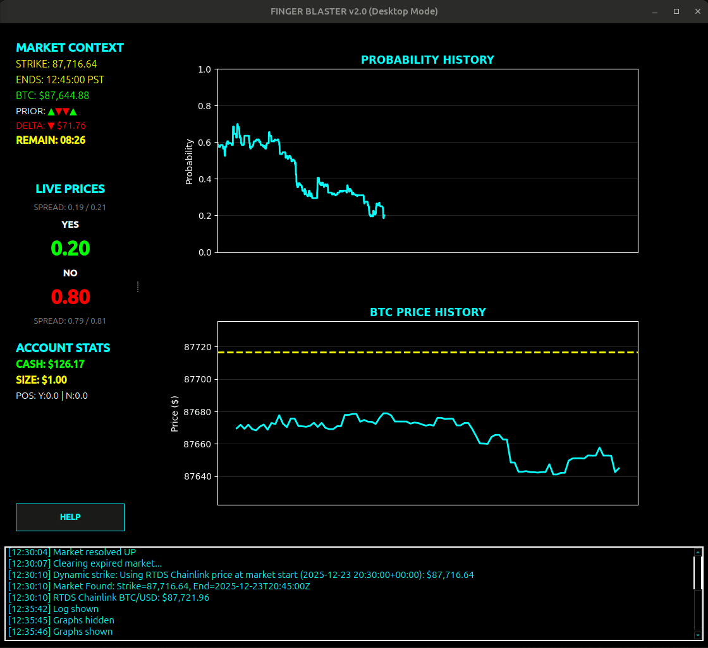
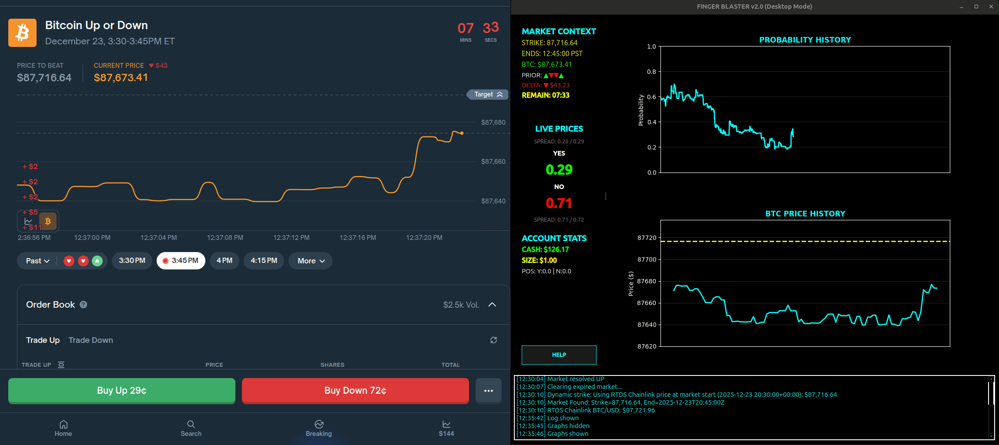

# FingerBlaster - Polymarket Trading Suite

<div align="center">


**A comprehensive suite of high-performance trading tools for Polymarket**

[Features](#-features) • [Installation](#-installation) • [Usage](#-usage) • [Documentation](#-documentation)

</div>

---

## Overview

FingerBlaster is a professional-grade trading suite designed for Polymarket's prediction markets. The suite includes three specialized tools, each optimized for different trading strategies and workflows:

- **Activetrader** - Quantitative trading terminal with real-time analytics and Black-Scholes pricing
- **Ladder** - DOM-style ladder interface for visualizing and executing orders across the full price range
- **Pulse** - Real-time market analytics dashboard with multi-timeframe technical indicators

All tools feature modern terminal UIs built with [Textual](https://textual.textualize.io/) and are designed for speed, precision, and professional trading workflows.

---

## 🎯 Features

### Activetrader 

A high-performance quantitative trading terminal specifically designed for Polymarket's "BTC Up or Down 15m" binary markets.

**Core Features:**
- ⚡ **Real-time Market Data** - Live WebSocket connection to Polymarket order books with automatic reconnection
- 🎯 **One-Key Trading** - Instant order placement (Y for YES, N for NO)
- 🧮 **Quantitative Analytics Engine**:
  - Black-Scholes fair value pricing for binary options
  - Real-time edge detection (BUY/SELL signals)
  - Z-score (σ) calculation with rolling volatility
  - Basis points (bps) distance from strike
  - Liquidity depth analysis and slippage estimation
  - Regime detection from prior market outcomes
  - Oracle lag monitoring (Chainlink vs CEX)
- ⏱️ **Dynamic Timer** - Color-coded urgency system (Green → Orange → Red blinking)
- 💰 **Real-time PnL** - Unrealized profit/loss tracking with percentages
- 🚨 **PANIC Button** - Press `F` to immediately flatten all positions
- 📈 **Position Management** - View positions, entry prices, and account statistics

### Ladder

A depth-of-market (DOM) style ladder interface for visualizing liquidity and executing orders across the entire price range.

**Core Features:**
- 📊 **Full Price Range Visualization** - See liquidity from 1¢ to 99¢
- 📈 **Volume Bars** - Visual representation of order book depth
- 🎯 **Cursor Navigation** - Navigate with arrow keys or vim-style (j/k)
- ⚡ **Quick Order Placement**:
  - Market orders: `y` (YES) / `n` (NO)
  - Limit orders: `t` (YES) / `b` (NO) at cursor price
- 🔍 **Order Management**:
  - View your orders at each price level
  - Cancel orders at cursor: `x`
  - Cancel all orders: `c`
  - Flatten positions: `f`
- 📏 **Size Control** - Adjust order size with `+`/`-` keys
- 🎨 **Color-coded Display** - Green for YES bids, Red for NO bids

### Pulse

Real-time market analytics dashboard with multi-timeframe technical analysis for Coinbase markets.

**Core Features:**
- 📊 **Multi-Timeframe Analysis** - 10s, 1m, 15m, 1h, 4h, Daily
- 📈 **Technical Indicators**:
  - RSI (Relative Strength Index)
  - MACD (Moving Average Convergence Divergence)
  - ADX (Average Directional Index)
  - VWAP (Volume Weighted Average Price)
  - Bollinger Bands
  - Support/Resistance levels
- 🎯 **Signal Scoring** - 0-100 score for each timeframe with trading signals
- 📉 **Order Flow Analysis** - Real-time trade flow visualization (10s timeframe)
- 🕯️ **Candle Analysis** - OHLC patterns and volume analysis (1m timeframe)
- 📊 **Market Structure** - Trend detection and swing analysis (15m+ timeframes)
- 🔄 **Real-time Updates** - Live data from Coinbase Advanced Trade API
- 🎨 **Visual Dashboard** - Color-coded signal cards with metrics

---

## 🚀 Installation

### Prerequisites

- **Python 3.8+** (Python 3.10+ recommended)
- **Polymarket Account** with API credentials
- **Private Key** for signing transactions
- **USDC Balance** on Polygon for trading
- **Coinbase API Credentials** (optional, for Pulse module)

### Step 1: Clone the Repository

```bash
git clone <repository-url>
cd finger_blaster
```

### Step 2: Create Virtual Environment

```bash
python -m venv venv
source venv/bin/activate  # On Windows: venv\Scripts\activate
```

### Step 3: Install Dependencies

```bash
pip install -r requirements.txt
```

### Step 4: Configuration

Copy the example environment file and configure your credentials:

```bash
cp env.example .env
```

Edit `.env` and add your credentials:

```env
# REQUIRED - Polymarket Authentication
PRIVATE_KEY=0x...                    # Your private key
POLY_API_KEY=your_api_key_here        # From https://polymarket.com/settings/api
POLY_API_SECRET=your_api_secret_here
POLY_API_PASSPHRASE=your_passphrase_here

# OPTIONAL - Coinbase API (for Pulse module)
COINBASE_API_KEY=your_coinbase_api_key_here
COINBASE_API_SECRET=your_coinbase_api_secret_here
# Only needed for legacy API keys (NOT required for CDP keys)
COINBASE_API_PASSPHRASE=
```

**⚠️ Security Note:** Never commit your `.env` file to version control!

---

## 💻 Usage

### Activetrader (Default)

Run the Activetrader terminal interface:

```bash
python main.py
```

or explicitly:

```bash
python main.py --activetrader
```

**Keyboard Shortcuts:**

| Key | Action |
|-----|--------|
| `Y` | Buy YES |
| `N` | Buy NO |
| `F` | ⚠️ **PANIC FLATTEN** - Sell all positions immediately |
| `C` | Cancel all pending orders |
| `+` / `=` | Increase order size by $1 |
| `-` | Decrease order size by $1 |
| `H` | Toggle graphs visibility |
| `L` | Toggle log panel visibility |
| `P` | Open position manager |
| `Q` | Quit application |

### Ladder

Run the ladder trading interface:

```bash
python main.py --ladder
```

or directly:

```bash
python -m src.ladder
```

**Keyboard Shortcuts:**

| Key | Action |
|-----|--------|
| `↑` / `↓` / `k` / `j` | Move cursor up/down |
| `m` | Center view on mid-price |
| `y` | Place market BUY YES order |
| `n` | Place market BUY NO order |
| `t` | Place limit BUY YES order at cursor |
| `b` | Place limit BUY NO order at cursor |
| `x` | Cancel orders at cursor price |
| `c` | Cancel all orders |
| `f` | Flatten all positions |
| `+` / `=` | Increase order size |
| `-` | Decrease order size |
| `?` / `h` | Show help overlay |
| `q` | Quit application |

### Pulse

Run the Pulse dashboard:

```bash
python main.py --pulse
```

or directly:

```bash
python -m src.pulse
```

**Command Line Options:**

```bash
# Specify products to track
python -m src.pulse --products BTC-USD ETH-USD

# Specify timeframes
python -m src.pulse --timeframes 1m 5m 1h

# Use streaming mode (no GUI)
python -m src.pulse --streaming

# Verbose logging
python -m src.pulse --verbose
```

**Available Timeframes:**
- `10s` - 10 Second (HFT analysis)
- `1m` - 1 Minute (Scalping)
- `5m` - 5 Minute
- `15m` - 15 Minute (Intraday)
- `1h` - 1 Hour (Swing Trading)
- `4h` - 4 Hour
- `1d` - Daily (Position Trading)

---

## 📊 Analytics Guide

### Activetrader Analytics

The analytics engine generates a complete snapshot every 500ms with the following metrics:

**Market Context:**
- **STRIKE** - Current strike price for the binary market
- **BTC** - Real-time BTC price (from Chainlink via RTDS)
- **DELTA** - Distance from strike in $ and basis points
- **SIGMA (σ)** - Z-score: How many standard deviations from strike
- **REMAIN** - Countdown timer with urgency coloring

**Price Analysis:**
- **Fair Value (FV)** - Black-Scholes calculated fair value
- **Edge** - Deviation from fair value in basis points
- **Signal** - BUY/SELL recommendation based on edge
- **DEPTH** - Dollar liquidity at top of book
- **SLIP** - Estimated slippage for current order size

**Account Stats:**
- **CASH** - Available USDC balance
- **SIZE** - Current order size
- **POS** - Open positions with entry prices
- **PnL** - Real-time unrealized profit/loss

### Trading Strategy Guide

**1. Edge Detection - When to Trade**
- **Green "BUY" signal**: Market price < Fair Value → Consider buying
- **Red "SELL" signal**: Market price > Fair Value → Consider selling/avoiding
- **Edge > 50bps**: Strong signal worth acting on
- **Edge < 50bps**: Fair pricing, be selective

**2. Z-Score (Sigma) - Position Confidence**

The σ metric shows how many standard deviations BTC is from the strike price, adjusted for time and volatility:

```
Z = ln(S/K) / (σ√T)
```

Where:
- **S** = Current BTC price
- **K** = Strike price (price to beat)
- **σ** = Annualized volatility (60% default, or realized vol)
- **T** = Time to expiry (in years)

**Interpretation:**
- **\|σ\| > 2.0**: Strong directional move, high confidence (rare events)
- **\|σ\| < 0.5**: Price near strike, coin-flip territory
- **Positive σ**: BTC above strike (YES favored)
- **Negative σ**: BTC below strike (NO favored)

**Example:** If BTC is trading at +1.5σ with 10 minutes remaining, it means BTC is 1.5 standard deviations above the strike—a statistically significant move that accounts for both the price distance and remaining time for mean reversion.

**3. Timer Urgency - Risk Management**
- **Green (>5 min)**: Normal trading, time for positions to work
- **Orange (2-5 min)**: Gamma increasing, be cautious with new entries
- **Red Blinking (<2 min)**: High gamma/theta risk, consider flattening

**6. Liquidity/Slippage - Execution Quality**
- **Depth**: Higher = better fills for larger orders
- **Slippage >50bps**: Consider scaling into position
- Check depth before using PANIC flatten

### Pulse Signal Interpretation

**Signal Score (0-100):**
- **70-100**: Strong bullish signal (green)
- **40-70**: Neutral/mixed signals (yellow)
- **0-40**: Strong bearish signal (red)

**Timeframe-Specific Analysis:**
- **10s (HFT)**: Order flow, trade delta, buy/sell pressure
- **1m (Scalp)**: Candle patterns, VWAP deviation, volume
- **15m (Intraday)**: Pattern recognition, momentum oscillators
- **1h+ (Swing)**: Market structure, support/resistance, trend exhaustion

---

## ⚙️ Configuration

### Activetrader Configuration

Key settings can be adjusted in `src/activetrader/config.py`:

**Trading Settings:**
- `order_rate_limit_seconds`: Minimum time between orders (default: 0.5s)
- `min_order_size`: Minimum order size (default: $1.00)
- `size_increment`: Order size increment (default: $1.00)
- `market_duration_minutes`: Market duration (default: 15 minutes)

**Analytics Settings:**
- `analytics_interval`: How often analytics update (default: 0.5s)
- `timer_critical_minutes`: Red zone threshold (default: 2 min)
- `timer_watchful_minutes`: Orange zone threshold (default: 5 min)
- `default_volatility`: Default BTC volatility for FV calc (default: 60%)
- `edge_threshold_bps`: Threshold for edge signals (default: 50 bps)
- `oracle_lag_warning_ms`: Yellow warning threshold (default: 500ms)
- `oracle_lag_critical_ms`: Red critical threshold (default: 2000ms)

### Pulse Configuration

Pulse configuration is set via `PulseConfig` in `src/pulse/config.py`:

```python
from src.pulse import PulseConfig, Timeframe

config = PulseConfig(
    products=["BTC-USD", "ETH-USD"],
    enabled_timeframes={
        Timeframe.ONE_MIN,
        Timeframe.FIVE_MIN,
        Timeframe.ONE_HOUR,
    }
)
```

---

## 🏗️ Architecture

### Core Components

**1. FingerBlasterCore** (`src/activetrader/core.py`)
- Shared business logic controller
- Manages market data, history, WebSocket, and order execution
- Event-driven callback system for UI updates
- UI-agnostic design

**2. AnalyticsEngine** (`src/activetrader/analytics.py`)
- Black-Scholes binary option pricing
- Rolling volatility calculation
- Edge detection and z-score
- Liquidity analysis and slippage estimation


**3. Manager Classes** (`src/activetrader/engine.py`)
- **MarketDataManager**: Market discovery, order book state, token mapping
- **HistoryManager**: Maintains price/BTC history using deques
- **WebSocketManager**: CLOB order book connection with auto-reconnect
- **OrderExecutor**: Market order execution with aggressive pricing
- **RTDSManager**: Real-time BTC price from Polymarket's RTDS WebSocket

**4. Connectors** (`src/connectors/`)
- **PolymarketConnector**: Wraps py-clob-client for API interactions
- **CoinbaseConnector**: Coinbase Advanced Trade API integration
- **AsyncHttpFetcherMixin**: Async HTTP request handling with retries

**5. UI Components**
- **Activetrader**: Terminal UI (`src/activetrader/gui/main.py`)
- **Ladder**: DOM ladder UI (`src/ladder/ladder.py`)
- **Pulse**: Dashboard UI (`src/pulse/gui/main.py`)

### Data Flow

```
Polymarket API/WebSocket + RTDS
    ↓
PolymarketConnector + RTDSManager
    ↓
FingerBlasterCore (Managers)
    ↓
AnalyticsEngine (Calculations)
    ↓
Event Callbacks
    ↓
UI Component (Terminal)
```

---

## 📸 Screenshots & Demos

### Terminal UI (Textual)


### Live Trading Demo


### Fullscreen Interface


### Side-by-Side with Polymarket


---

## 🔧 Troubleshooting

### WebSocket Connection Issues

- Check internet connection
- Verify Polymarket API is accessible
- Check logs in `data/finger_blaster.log`
- Ensure firewall isn't blocking WebSocket connections

### Order Execution Issues

- Verify `.env` file has correct `PRIVATE_KEY`
- Ensure sufficient USDC balance on Polygon
- Check rate limiting (0.5s between orders)
- Review logs for specific error messages
- Verify API credentials are correct

### Analytics Not Updating

- Ensure market is active (not expired)
- Check that BTC price is updating
- Verify WebSocket connection is alive
- Check logs for analytics errors

### Coinbase API Issues (Pulse)

- Verify API credentials in `.env`
- Check if using CDP (JWT) or Legacy (HMAC) keys
- For CDP keys: Ensure `PyJWT` and `cryptography` are installed
- For Legacy keys: Ensure passphrase is set
- Check API key permissions (View permission required)

---

## 📁 Project Structure

```
finger_blaster/
├── main.py                 # Main entry point
├── requirements.txt        # Python dependencies
├── env.example            # Environment configuration template
├── data/                  # Data directory
│   ├── images/           # Icons and screenshots
│   └── *.log             # Application logs
├── src/
│   ├── activetrader/     # Activetrader tool
│   │   ├── core.py       # FingerBlasterCore
│   │   ├── analytics.py  # AnalyticsEngine
│   │   ├── engine.py     # Manager classes
│   │   ├── config.py      # Configuration
│   │   └── gui/          # Terminal UI
│   ├── ladder/          # Ladder tool
│   │   ├── ladder.py     # Main ladder UI
│   │   ├── core.py       # LadderCore
│   │   └── ladder_data.py # Data models
│   ├── pulse/           # Pulse tool
│   │   ├── core.py       # PulseCore
│   │   ├── config.py     # Configuration
│   │   ├── indicators.py # Technical indicators
│   │   ├── aggregators.py # Data aggregation
│   │   └── gui/          # Dashboard UI
│   └── connectors/       # API connectors
│       ├── polymarket.py # Polymarket API
│       ├── coinbase.py   # Coinbase API
│       └── ...
└── tests/                # Unit tests
```

---

## 🔒 Security

- **Private Keys**: Never commit your `.env` file to version control
- **API Credentials**: Store securely and never share
- **Transactions**: All transactions are signed locally with your private key
- **PANIC Button**: No confirmation dialog - be careful!
- **Network**: All API communications use HTTPS/WSS

---

## 📝 Notes

- **BTC Price Source**: Uses RTDS Chainlink BTC/USD prices (matches Polymarket resolution), falls back to Binance API
- **Fair Value**: Calculated using Black-Scholes with 60% default volatility, 0% risk-free rate
- **Edge Detection**: 50 bps threshold for BUY/SELL signals (configurable)
- **Market Orders**: Use aggressive pricing (10% above/below mid) to ensure fills
- **Order Size**: Defaults to $1.00 and can be adjusted with +/- keys
- **Rate Limiting**: 0.5 seconds between orders to prevent API throttling
- **PANIC Button**: Press `F` for immediate position exit (no confirmation)

---

## 🤝 Contributing

Contributions are welcome! Please ensure:
- Code follows existing style
- New features are tested
- Documentation is updated
- Analytics calculations are validated
- Type hints are used where appropriate

---

## 📄 License

This project is provided as-is for educational and personal use.

---

## 🙏 Acknowledgments

- Built with [Textual](https://textual.textualize.io/) for terminal UIs
- Uses [py-clob-client](https://github.com/Polymarket/py-clob-client) for Polymarket integration
- Coinbase Advanced Trade API for market data

---

<div align="center">

**Version**: 3.0  
**Last Updated**: 2025

**New in v3.0**: Quantitative Analytics Engine, PANIC Button, Dynamic Timer Urgency, Edge Detection, Z-Score/Sigma, Real-Time PnL, Ladder Tool, Pulse Dashboard

</div>
