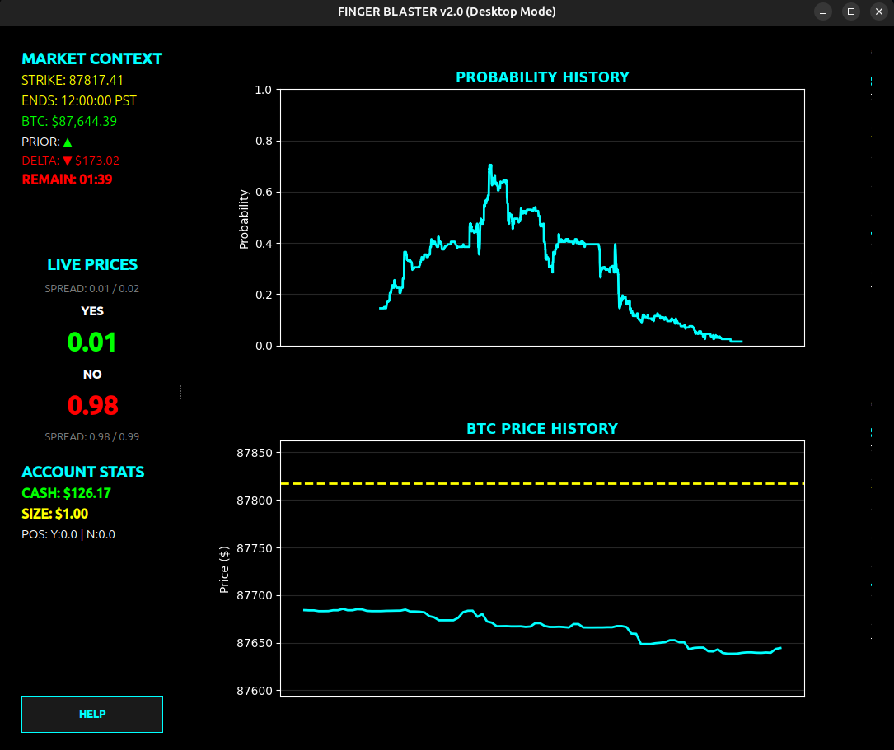
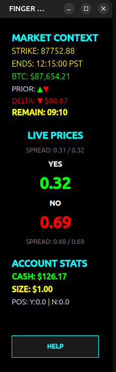

# FingerBlaster - Polymarket Trading Interface


A high-performance trading interface for Polymarket's "BTC Up or Down 15m" markets. Features real-time WebSocket updates, live charts, dual UI modes (terminal and desktop), and lightning-fast order execution.

## 🎯 Features

### Core Functionality
- **Real-time Market Data**: Live WebSocket connection to Polymarket order books with automatic reconnection
- **Dual UI Modes**: Choose between terminal-based (Textual) or desktop (PyQt6) interface
- **Live Charts**: 
  - Probability chart showing YES price history over time
  - BTC price chart with strike price overlay
  - Charts can be toggled on/off for performance
- **Quick Trading**: One-key order placement (Y for YES, N for NO)
- **Position Management**: Flatten positions and cancel orders with single keystrokes
- **Market Context**: 
  - Strike price display
  - Real-time countdown timer (updates every 200ms)
  - Live BTC price with delta calculation
  - Prior outcomes tracking (shows consecutive market results)
- **Resolution Overlay**: Visual notification when markets resolve
- **Account Statistics**: Real-time balance, YES/NO positions with average entry prices, and order size display

### Architecture
- **Modular Design**: Shared core logic (`FingerBlasterCore`) used by both UIs
- **Event-Driven**: Callback-based system for UI updates
- **Async/Await**: Fully asynchronous for optimal performance
- **Error Handling**: Comprehensive error handling and logging

## 📸 Screenshots

### Desktop UI (PyQt6)


### Terminal UI (Textual)


### Desktop UI - Compact Mode


## 🎬 Demo Videos

### Live Trading Demo


### Fullscreen Interface


### Side-by-Side with Polymarket


## 🚀 Installation

### Prerequisites
- Python 3.8 or higher
- Valid Polymarket account with API credentials
- Private key for signing transactions
- USDC balance on Polygon for trading

### Step 1: Install Dependencies

```bash
pip install -r requirements.txt
```

### Step 2: Desktop UI (Optional)

If you want to use the desktop UI, you may need to install system libraries:

**Ubuntu/Debian:**
```bash
sudo apt-get update
sudo apt-get install libxcb-cursor0 libxcb-cursor-dev
```

**Fedora/RHEL/CentOS:**
```bash
sudo dnf install libxcb-cursor
```

**Arch Linux:**
```bash
sudo pacman -S libxcb-cursor
```

See [INSTALL_DESKTOP.md](INSTALL_DESKTOP.md) for detailed installation instructions and troubleshooting.

### Step 3: Configuration

Create a `.env` file in the project root:

```env
PRIVATE_KEY=your_private_key_here
WALLET_ADDRESS=your_wallet_address_here  # Optional, for proxy wallets
```

## 💻 Usage

### Terminal UI (Default)

Run the application with the terminal interface:

```bash
python main.py
```

or

```bash
python main.py --textual
```

### Desktop UI

Run the application with the desktop interface:

```bash
python main.py --desktop
```

or

```bash
python main.py --pyqt
```

## ⌨️ Keyboard Shortcuts

Both UI modes support the same keyboard shortcuts:

| Key | Action |
|-----|--------|
| `Y` / `y` | Buy YES |
| `N` / `n` | Buy NO |
| `F` / `f` | Flatten all positions |
| `C` / `c` | Cancel all pending orders |
| `+` / `=` | Increase order size by $1 |
| `-` / `_` | Decrease order size by $1 |
| `H` / `h` | Toggle graphs visibility |
| `L` / `l` | Toggle log panel visibility |
| `Q` / `q` | Quit application |

### Desktop UI Additional Features
- **Help Dialog**: Click the "HELP" button to view keyboard shortcuts
- **Button Interface**: All actions available via clickable buttons
- **Resizable Windows**: Adjust window size to your preference
- **Average Entry Prices**: Displays average entry prices for positions in the format "Y:10.0 @45c" (10 shares at 45 cents average)

## ⚙️ Configuration

The application automatically:
- Discovers active "BTC Up or Down 15m" markets
- Connects to WebSocket for real-time price updates
- Updates account balances, positions, and average entry prices every 10 seconds
- Updates BTC price via RTDS in real-time (Chainlink prices matching Polymarket resolution)
- Updates market status every 5 seconds
- Tracks prior market outcomes with timestamps (last 10 consecutive markets)
- Shows resolution overlay when markets expire

### Configuration Options

Key settings can be adjusted in `src/config.py`:

- `order_rate_limit_seconds`: Minimum time between orders (default: 0.5s)
- `min_order_size`: Minimum order size (default: $1.00)
- `size_increment`: Order size increment (default: $1.00)
- `market_duration_minutes`: Market duration (default: 15 minutes)
- `max_prior_outcomes`: Maximum prior outcomes to track (default: 10)

## 📁 Data Files

The application creates a `data/` directory containing:

- `finger_blaster.log` - Application logs with timestamps
- `prior_outcomes.json` - History of market resolutions with timestamps
- `images/` - Application icons and screenshots
- `*.gif` - Demo videos showing the application in action

## 🏗️ Architecture

### Core Components

1. **FingerBlasterCore**: Shared business logic controller
   - Manages market data, history, WebSocket, and order execution
   - Event-driven callback system for UI updates
   - UI-agnostic design

2. **MarketDataManager**: Handles market discovery and data
   - Finds active markets
   - Calculates mid prices
   - Manages token maps

3. **HistoryManager**: Tracks price and BTC history
   - Maintains YES price history
   - Maintains BTC price history
   - Provides data for charts

4. **WebSocketManager**: Real-time data connection
   - Connects to Polymarket WebSocket
   - Automatic reconnection on failure
   - Handles ping/pong for connection health

5. **OrderExecutor**: Order placement and management
   - Executes market orders with aggressive pricing
   - Flattens positions
   - Cancels pending orders

6. **RTDSManager**: Real-time data stream for crypto prices
   - Connects to Polymarket's RTDS WebSocket for BTC prices
   - Provides Chainlink BTC/USD prices (matches Polymarket's resolution source)
   - Falls back to Binance API if RTDS unavailable
   - Maintains historical price data for dynamic strike price resolution

7. **UI Components**:
   - **Terminal UI** (`main.py`, `src/ui.py`): Textual-based interface
   - **Desktop UI** (`main_pyqt.py`, `src/ui_pyqt.py`): PyQt6-based interface

### Data Flow

```
Polymarket API/WebSocket
    ↓
PolymarketConnector
    ↓
FingerBlasterCore (Managers)
    ↓
Event Callbacks
    ↓
UI Components (Terminal/Desktop)
```

## 📊 Features in Detail

### Prior Outcomes Tracking

The application tracks the last 10 consecutive market outcomes, showing them as:
- `▲` for YES outcomes
- `▼` for NO outcomes

Outcomes are matched by timestamp to ensure only consecutive markets are displayed.

### Resolution Overlay

When a market expires, a full-screen overlay appears showing:
- **YES** (green background) if BTC price >= strike price
- **NO** (red background) if BTC price < strike price

The overlay displays for 3 seconds before the application searches for the next market.

### Account Statistics

The Account Statistics panel displays:
- **Cash Balance**: Current USDC balance available for trading
- **Order Size**: Current order size setting (adjustable with +/- keys)
- **Positions**: 
  - YES position: Number of YES shares held
  - NO position: Number of NO shares held
  - **Average Entry Price**: For each position, displays the weighted average entry price in cents (e.g., "Y:10.0 @45c" means 10 YES shares purchased at an average of 45 cents)

Average entry prices are calculated using weighted averages when adding to existing positions and reset when positions are flattened.

### Charts

**Probability Chart**: Shows YES price history over the market duration with:
- Green line for YES price
- X-axis: Time elapsed (0 to 15 minutes)
- Y-axis: Price (0.00 to 1.00)

**BTC Chart**: Shows BTC price history with:
- Cyan line for BTC price
- Yellow line for strike price (if available)
- Automatic scaling with padding

### Real-time Updates

- **Price Updates**: Via WebSocket, updates as order book changes
- **BTC Price**: Updates via RTDS (Real Time Data Stream) using Chainlink prices (matches Polymarket resolution), falls back to Binance API every 3 seconds
- **Countdown**: Updates every 200ms for smooth ticking
- **Account Stats**: Updates every 10 seconds (includes average entry prices for positions)
- **Market Status**: Checks for new markets every 5 seconds

## 🔧 Troubleshooting

### Desktop UI Issues

If the desktop UI fails to launch:

1. **Missing System Libraries**: See [INSTALL_DESKTOP.md](INSTALL_DESKTOP.md)
2. **Wayland**: Try `export QT_QPA_PLATFORM=wayland`
3. **X11 Issues**: Ensure X11 is running and accessible

### WebSocket Connection Issues

- Check internet connection
- Verify Polymarket API is accessible
- Check logs in `data/finger_blaster.log`

### Order Execution Issues

- Verify `.env` file has correct `PRIVATE_KEY`
- Ensure sufficient USDC balance
- Check rate limiting (0.5s between orders)
- Review logs for specific error messages

## 📝 Notes

- **BTC Price Source**: The application uses RTDS (Real Time Data Stream) to get Chainlink BTC/USD prices, which matches Polymarket's internal price source for market resolution. Falls back to Binance API if RTDS is unavailable.
- **Average Entry Prices**: The application tracks and displays average entry prices for YES and NO positions, shown in cents (e.g., "Y:10.0 @45c" means 10 shares at 45 cents average entry price).
- **Market Orders**: Use aggressive pricing (10% above/below mid) to ensure fills
- **Order Size**: Defaults to $1.00 and can be adjusted with +/- keys
- **Rate Limiting**: 0.5 seconds between orders to prevent API throttling
- **Prior Outcomes**: Stored with timestamps for accurate consecutive market matching
- **UI Consistency**: Both UI modes share the same core logic, ensuring consistent behavior

## 🔒 Security

- **Private Keys**: Never commit your `.env` file to version control
- **API Credentials**: Store securely and never share
- **Transactions**: All transactions are signed locally with your private key

## 📄 License

This project is provided as-is for educational and personal use.

## 🤝 Contributing

Contributions are welcome! Please ensure:
- Code follows existing style
- New features are tested
- Documentation is updated
- Both UI modes are considered

---

**Version**: 2.0  
**Last Updated**: 2024
